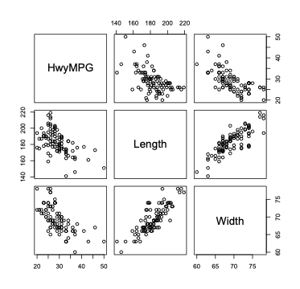

# Multiple Linear Regression

Basic idea: we have more than one covariate or predictor for modeling a dependent variabl


Predicting Highway MPG in cars based on car specifications, 93 observations, 26 variables

```{verbatim}
> names(car.data)
 [1] "Manuf"         "Model"         "Type"         
 [4] "MinPrice"      "MidRangePrice" "MaxPrice"     
 [7] "CityMPG"       "HwyMPG"        "AirBags"      
[10] "DriveTrain"    "Cyl"           "EngSize"      
[13] "HPW"           "RPM"           "Rev"          
[16] "ManTran"       "GasTank"       "PassCap"      
[19] "Length"        "WheelBase"     "Width"        
[22] "U-turn"        "RearSeat"      "Luggage"      
[25] "Weight"        "Domest"   
```

Consumer Reports: The 1993 Cars - Annual Auto Issue (April 1993), Yonkers, NY: Consumers Union
When predicting Highway MPG, there are perhaps many informative predictors.
we'll start by looking at two possible predictors, such as the vehicle Length and Width.

```{verbatim}
> plot(car.data[,c(8,19,21)])	
```

<figure markdown="span">
  { width="500" }
  <figcaption>Image caption</figcaption>
</figure>

Length and Width are both correlated with MPG (making them potentially good predictors), and it looks like these potential predictors of Length and Width are also correlated with each other.


A multiple linear regression model with two independent variables:

$$
Y_{i}=\beta_{0} +\beta_{1}x_{1i} +\beta_{2}x_{2i}+ \epsilon_{i}
$$


- $Y_{i}$ is the response or dependent variable for observation $i$\\
- $x_{1i}$ is the observed predictor, explanatory variable, independent variable, covariate for variable 1 observation $i$\\
- $x_{2i}$ is the observed predictor, explanatory variable, independent variable, covariate for variable 2 observation $i$\\
- $\epsilon_{i}$ is the error term with $\epsilon_{i} \stackrel{iid}{\sim} N(0,\sigma^2)$\\

So, $E[Y_{i}|x_{1i},x_{2i}]=\beta_{0} +\beta_{1}x_{1i} +\beta_{2}x_{2i}$

In this model, we assume $Y$ and $X_{1}$ are linearly related, and Y and $X_{2}$ are linearly related

Return to MPG example

 After predicting MPG from Width, what \% of the variability in MPG is \underline{left to be explained}?

```{verbatim}
> attach(car.data)
> lm.out=lm(HwyMPG ~ Width) 
> summary(lm.out)$r.squared
[1] 0.4100599
```

Does including Length as a predictor improve the overall \% explained?

```{verbatim}
> lm.out.2=lm(HwyMPG ~ Width + Length)
> summary(lm.out.2)$r.squared
[1] 0.4108926
```

 It explains only a {\it little} bit more than Width alone

 From the scatterplot, it looked like Length and MPG (covariate and response) were negatively correlated.  But, Length was also correlated with Width (the other predictor variable in the model).

```{verbatim}
> cor(HwyMPG,Length)
[1] -0.5428974

> cor(Width,Length)
[1] 0.8221479
```

So, there is a lot of redundant information in Length and Width when trying to predict MPG.  We gained little by including Length after Width was already in the model.

A simple linear regression model including only MPG and Length provides an $R^{2}$ of 0.30 (a `fair' predictor),  but this is not as high as when Width as the only predictor.

```{verbatim}
> lm.out.Length=lm(HwyMPG ~ Length)
> summary(lm.out.Length)$r.squared
[1] 0.2947376
```


For other variables or data sets, it may be the case where we may gain a lot from the inclusion of more predictors


# Notation 

 Lease squares estimates\\

 With $k$ covariates, we just extend this to minimize\\

$\sum_{i=1}^{n} (Y_{i}-(b_{0}+b_{1}x_{1i}+\ldots+b_{k}x_{ki}))^{2}$\\

To get the parameter estimates, we take the derivative with respect to each regression coefficient, set the equations equal to 0, and solve.

Estimate for $\sigma^2$

 $\sigma^2$ is estimated as before with the residuals, but we now divide the RSS by (n-(k+1))=(n-k-1) since there are k+1 parameters estimated.\\

 $\hat{\sigma^2}=S_{E}^{2} = \frac{RSS}{n-k-1}=\frac{\sum_{i=1}^{n}(Y_{i}-\hat{Y}_{i})^{2}}{n-k-1}$\\

- SSE = RSS
- $E[\frac{RSS}{n-k-1}]=\sigma^2$
- $S_{E}$ is the {\it  standard error for the regression}
- $\hat{\sigma}=S_{E}=\sqrt{S_{E}^{2}}$
- Another term often used, is MSE where $MSE=\frac{SSE}{n-k-1}=\frac{RSS}{n-k-1}$
