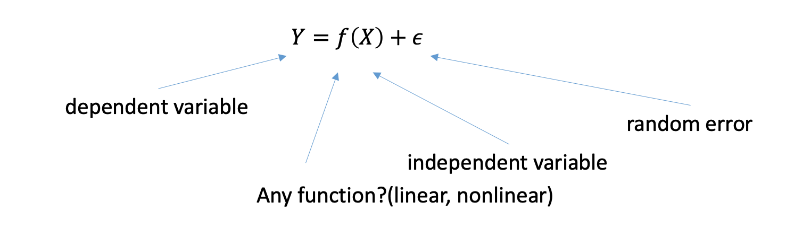

Regression analysis is a class of statistical methods for 

- Examining the relationships between measurable variables, such as the connection between blood pressure and age.
- Utilizing known values of certain variables to predict the values of other variables for the same individuals, such as using a person’s age, cholesterol level, and weight to estimate their blood pressure.

Regression analysis examines the conditional distribution of Y—or specific aspects of it, such as the mean—based on a function of the X’s. It models the general relationship between X and Y, incorporating a random error term ($\epsilon$) to account for variability not explained by X.

<figure markdown="span">
  { width="500" }
  <figcaption>Regression Model</figcaption>
</figure>

The setup of your regression model largely depends on the specific goals of your analysis. Inference vs. Prediction 

Primary goal is to predict the outcomes for new data 

 Y = patient’s risk for severe side effects
 X’s = characteristics of patient’s blood samples

Y = Positive/negative response to marketing campaign
X’s = customer demographic variables

Inference: The goal is to understand the relationship between X’s and Y. Which predictors are significant? Can the relationship be effectively modeled?

Y = product sales
X’s = advertising budgets (TV, radio, newspaper)

Y = probability of product purchase
X’s = price, store location, discounts, competitor’s price
