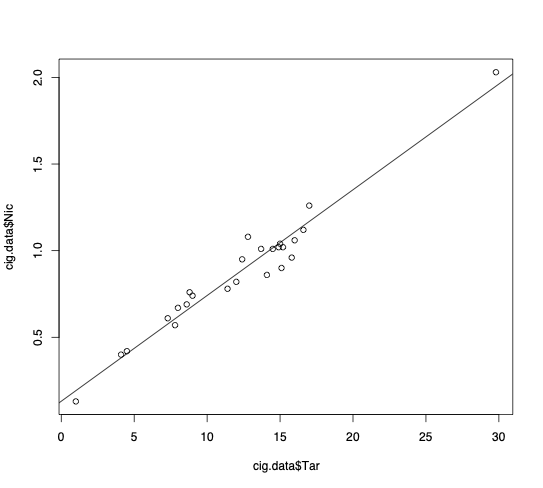
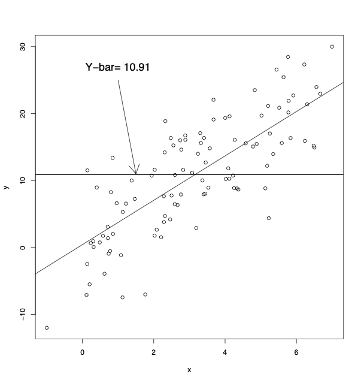

# Simple Linear Regression

Methods for analyzing the relationship between two or more quantitative variables, such as examining the impact of lead exposure on school performance or predicting the force at which a metal alloy rod bends based on its iron content.

The basic model

$$Y_{i}=\beta_{0} +\beta_{1}x_{i} + \epsilon_{i}$$

- $Y_{i}$ is the response of dependent variable
- $x_{i}$ is the observed predictor, explanatory variable, independent variable, covariate
- $x_{i}$ is treated as a fixed quantity (or if random it is conditioned upon)
- $\epsilon_{i}$ is the error term 
- $\epsilon_{i}$ are iid $N(0,\sigma^2)$

So, $E[Y_{i}]=\beta_{0} +\beta_{1}x_{i} +0 =\beta_{0} +\beta_{1}x_{i}$ 


Key assumptions

- Linear relationship (between Y and x. *we say the relationship between Y and x is linear if the means of the conditional distributions of Y$|$x lie on a straight lin
- independent errors ((independent observations in SLR)
- Constant variance of error
- Normally distributed errors

## Interpreting the model

The model can also be expressed as:

$$
Y_{i}|X_{i}=x_{i} \; \; \sim \; \; N(\beta_{0} +\beta_{1}x_{i},\sigma^2)
$$

- Mean of $Y$ given $X=x$ is $\beta_{0} +\beta_{1}x$ (known as conditional mean).
- $\beta_{0} +\beta_{1}x$ is the **mean value** of all the $Y$'s for the given value of $x$.
- $\beta_{0}$ is conditional mean when $x$=0.
- $\beta_{1}$ is slope, change in mean of $Y$ per 1 unit change in $x$.
- $\sigma^2$ is the variation of responses at $x$ (i.e.~dispersion around conditional mean).

## Estimation of $\beta_{0}$ and$\beta_{1}$
We wish to use the sample data to  estimate the population parameters: the slope $\beta_{1}$ and the intercept $\beta_{0}$. 
Least squares estimation:

- choose $\hat{\beta_{0}}=b_{0}$ and $\hat{\beta_{1}}=b_{1}$.
such that we minimize the sum of the squared residuals, i.e.~minimize $\sum_{i=1}^{n}(Y_{i}-\hat{Y}_{i})^{2}$.

- minimize 
$$g(b_{0},b_{1})=\sum_{i=1}^{n}(Y_{i}-(b_{0}+b_{1}x_{i}))^{2}$$

- Take derivative of $g(b_{0},b_{1})$ with respect to $b_{0}$ and $b_{1}$, set equal to zero, and solve.

Results: 

$$ b_{0}=\bar{Y}-b_{1}\bar{x} $$

$$ b_{1}=\frac{\sum_{i=1}^{n} (x_{i}-\bar{x})(Y_{i}-\bar{Y})}{\sum_{i=1}^{n} (x_{i}-\bar{x})^{2}} $$

 The point $(\bar{x},\bar{Y})$ will always be on the least squares line

-  $b_{0}$ and $b_{1}$ are best linear unbiased estimators (best meaning smallest variance estimator)

 Notation for fitted line:

$$\hat{Y}_{i}=\hat{\beta}_{0} + \hat{\beta}_{1} x_{i}$$

$$\hat{Y}_{i}=b_{0} + b_{1} x_{i}$$

Predicted (fitted) value: $\hat{Y}_{i}=b_{0}+b_{1}x_{i}$

residual: $e_{i}=Y_{i}-\hat{Y}_{i}$

The least squares regression line minimizes the residual sums of squares (RSS)=$\sum_{i=1}^{n}(Y_{i}-\hat{Y}_{i})^{2}$


## Example : Cigarette data
Measurements of weight and tar, nicotine, and carbon monoxide content
are given for 25 brands of domestic cigarettes

```
VARIABLE DESCRIPTIONS:
Brand name 
Tar content (mg)
Nicotine content (mg)
Weight (g)
Carbon monoxide content (mg)
```

```{verbatim}
> cig.data=as.data.frame(read.delim("cig.txt",sep=" ",
                                         header=FALSE))
> dim(cig.data)
[1] 25  5

## This data set had no header, so I will assign 
## the column names here:
> dimnames(cig.data)[[2]]=c("Brand","Tar","Nic",
                                         "Weight","CO")
> head(cig.data)
          Brand  Tar  Nic Weight   CO
1        Alpine 14.1 0.86 0.9853 13.6
2 Benson-Hedges 16.0 1.06 1.0938 16.6
3    BullDurham 29.8 2.03 1.1650 23.5
4   CamelLights  8.0 0.67 0.9280 10.2
5       Carlton  4.1 0.40 0.9462  5.4
6  Chesterfield 15.0 1.04 0.8885 15.0
```
```{verbatim}
> plot(cig.data$Tar,cig.data$Nic)
```
<figure markdown="span">
  { width="500" }
  <figcaption>Scatter plot</figcaption>
</figure>


```{verbatim}
## Fit a simple linear regression of Nicotine on Tar.
> lm.out=lm(Nic~Tar,data=cig.data)

## Get the estimated slope and intercept:
> lm.out$coefficients
(Intercept)         Tar 
 0.13087532  0.06102854 
```

```{verbatim}
## Add the fitted line to the original plot:
> plot(cig.data$Tar,cig.data$Nic)
> abline(lm.out)
```


<figure markdown="span">
  { width="500" }
  <figcaption>Image caption</figcaption>
</figure>

<figure markdown="span">
  { width="500" }
  <figcaption>Image caption</figcaption>
</figure>


Recall the model: 

$Y_{i}=\beta_{0} +\beta_{1}x_{i} + \epsilon_{i}$ with $\epsilon_{i} \stackrel{iid}{\sim} N(0,\sigma^2)$

We use the sum of the squares of the residuals to estimate $\sigma^2$

- RSS $\equiv$ Residual sum of squares
- SSE $\equiv$ Sum of squared errors
- RSS $\equiv$ SSE

- $\hat{\sigma^2}= \frac{RSS}{n-2}=\frac{\sum_{i=1}^{n}(Y_{i}-\hat{Y}_{i})^{2}}{n-2}$$

- RSS = $\sum_{i=1}^{n}(Y_{i}-\hat{Y}_{i})^{2}$


$E[\frac{RSS}{n-2}]=\sigma^2$, $\hat{\sigma}$ = $S_{E}=\sqrt{S_{E}^{2}}$  is called the standard error for the regression

## Total sums of squares (TSS)
Total sums of squares (TSS) quantifies the overall squared distance of the $Y$-values from the overall mean of the responses $\bar{Y}$.

<figure markdown="span">
  { width="500" }
  <figcaption>Image caption</figcaption>
</figure>

Which leads to the equation

$$\sum_{i=1}^{n}(Y_{i}-\bar{Y})^{2}=\sum_{i=1}^{n}(Y_{i}-\hat{Y}_{i})^{2} + \sum_{i=1}^{n}(\hat{Y}_{i}-\bar{Y})^{2}$$

$$TSS=RSS + RegSS$$

where $RegSS$ is the  regression sum of squares. Total variability has been decomposed into ``explained`` and ``unexplained`` variability. In general, when the proportion of total variability that is explained is high, we have a good fitting model

The $R^{2}$ value (coefficient of determination):

- the proportion of variation in the response that is explained by the model.
- $R^{2}=\frac{RegSS}{TSS}$.
- $R^{2}=1-\frac{RSS}{TSS}$.
- also stated as $r^{2}$ in simple linear regression.
- $0 \leq R^{2}\leq 1$.
- $R^{2}$ near 1 suggests a good fit to the data.
- if $R^{2}=1$, aLL points fall it exactly on the line. 
- different disciplines have different views on what is a {\it high} $R^{2}=1$, in other words what is a good model. 

Note: social scientists may get excited about an $R^{2}$ near 0.30, a researcher with a designed experiment may want to see an $R^{2}$ near 0.80

 ## Analysis of Variance (ANOVA)
 The decomposition of total variance into parts is part of ANOVA
As was stated before: $TSS=RSS + RegSS$

<figure markdown="span">
  { width="500" }
  <figcaption>Image caption</figcaption>
</figure>

<figure markdown="span">
  { width="500" }
  <figcaption>Image caption</figcaption>
</figure>

Get the $R^{2}$ value (2 ways shown):


```{verbatim}
> summary(lm.out)
look for....  Multiple R-Squared: 0.9538 

> summary(lm.out)$r.squared
[1] 0.9537625
```

## Correlation coefficient
The  correlation coefficient r measures the strength of a  linear relationship

$$
\begin{aligned}
r&=&\frac{\sum_{i=1}^{n} (X_{i}-\bar{X})(Y_{i}-\bar{Y})}{\sqrt{\sum_{i=1}^{n} (X_{i}-\bar{X})^{2}\sum_{i=1}^{n} (Y_{i}-\bar{Y})^{2}}} \\
&=&\frac{\sqrt{\frac{\sum_{i=1}^{n} (X_{i}-\bar{X})^{2}}{n-1}}}{\sqrt{\frac{\sum_{i=1}^{n} (Y_{i}-\bar{Y})^{2}}{n-1}}} \cdot b_{1} \\
&=&\frac{S_{X}}{S_{Y}} \cdot b_{1}
\end{aligned}
$$

 - it is the standardized slope, a unitless measure, 
 - can be thought of as the value we would get for the slope if the standard deviations of $X$ and $Y$ were equal similar spreads
- would be the slope if $X$ and $Y$ had been standardized before fitting the regression
- $-1 \leq r \leq 1$
- $r$ near -1 or +1 shows a strong linear relationship
- a negative (positive) $r$ is associated with an estimated negative (positive) slop
- the sample correlation coefficient $r$ estimates the population correlation coefficient $\rho$.
- $r$ is NOT used to measure strength of a curved line

## Common mistake
People often think that as the estimated slope of the regression line, $\hat{\beta}_{1}$, gets larger (steeper), so does $r$.  But $r$ really measures how close all the data points are to our estimated regression line.

You could have a steep fitted line with a small $r$ (noisy relationship), or a fairly flat fitted line with large $r$ (less noisy relationship).

This can be confusing because when the estimated slope is actually 0, then $r$ is 0 no matter how close the points are to the regression line (see formulas for $r$ on the previous pages).

