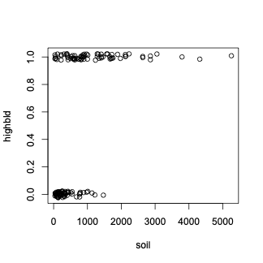

# Introduction

When the response variable is a binary variable, such as 0 or 1, live or die,  fail or succeed,  we approach our modeling a little differently.  Let look at a real example: study the effect of the level of lead in the soil in the subject’s backyard (X) on lead blood level (Y). The level of lead is continous but the lead blood level can be either high lead blood level(1) or low lead blood level(0). If you plot the X vs Y, you get 

<figure markdown="span">
  { width="300" }
  <figcaption>Image caption</figcaption>
</figure>

Consider the usual regression model:

$$Y_{i}=\beta_0 + \beta_1 x_{i} +\epsilon_{i}$$

The fitted model and residuals:
$$ \hat{Y}=0.3178 + 0.0003x $$

All sorts of violations here:
<figure markdown="span">
  { width="500" }
  <figcaption>Image caption</figcaption>
</figure>

Let trust the model and find the prediction for x=3000, $$ \hat{Y}_{x=3000}=1.14 $$, and this is not possibly an average of the 0s and 1s. We need a better approach, tp model 0-1 response regression: we can model on $P(Y=1)$: We will consider this probability of getting a
1 given the x-value(s) in our modeling 
$$
\pi_i=P(Y_i=1| X_i)=1-P(Y_i=0| X_i)
$$

actually by a transformation of this prob ability $\pi_i$ that we will use as our response
in the regression model.

## Odds of an Event
Let discuss the odd of en even: \n
We flip two fair coins, the the probabilities of two heads or not two heads are
$$
P(two heads)=1/4
$$
$$
P(not two heads)=3/4
$$

The odds in favor of getting two heads is:

$$
odds=\frac{P(two heads)}{P(not two heads)}=\frac{1/4}{3/4}=1/3
$$

referred to as 1 to 3 odds. You’re 3 times as likely to not get 2 heads
as you are to get 2 heads

## odds ratio
Let consider a binary variable $Y$ (2 possible outcomes), odds in favor of Y=1 is

$$
\frac{P(Y=1)}{P(Y=0)}=\frac{P(Y=1)}{1-P(Y=1)}
$$

For example, if P(heart attack)=0.0018, then the odds of a heart attack is

$$
\frac{0.0018}{0.9982}=\frac{0.0018}{1-0.0018}=0.001803
$$

The ratio of the odds for two different groups
is also a quantity of interest. For example, consider heart attacks for
“male nonsmoker vs. male smoker”. 

Suppose P(heart attack)=0.0036 for a male smoker, and P(heart attack)=0.0018 for a
male nonsmoker.  Then, the odds ratio (O.R.) for a heart at-
tack in nonsmoker vs. smoker is

$$
\begin{aligned}
O.R. &=& \frac{\mbox{odds of a heart attack for non-smoker}}{\mbox{odds of a heart attack for smoker}} \\
&=& \frac{\left(\frac{Pr(\mbox{heart attack$|$non-smoker})}{1-Pr(\mbox{heart attack$|$non-smoker})}\right)}{\left(\frac{Pr(\mbox{heart attack$|$smoker})}{1-Pr(\mbox{heart attack$|$smoker})}\right)} \\
&=&\frac{\left(\frac{0.0018}{0.9982}\right)}{\left(\frac{0.0036}{0.9964}\right)}=0.4991
\end{aligned}
$$

Interpretation of the odds ratio for binary 0-1

-  If O.R.= 1.0, then P(Y = 1) is the same
in both samples
- If O.R.<1.0, then P(Y = 1) is less in the
numerator group than in the denominator
group
- O.R.= 0 if and only if P(Y = 1) = 0 in
numerator sample

## Logistic Regression 
The response variable we will model is a transformation of $P(Y_i = 1)$ for a given $X_i$. The transformation is the logit transformation
$$
logit(a)=ln \left(\frac{a}{1-a}\right)
$$

The response variable we will use:
$$
logit[P(Y_{i}=1)]=ln \left( \frac{P(Y_{i}=1)}{1-P(Y_{i}=1)} \right)
$$
This is the log$_{e}$ of the odds that $Y_{i}=1$. Notice: $P(Y_{i}=1) \in (0,1)$

This response on the left isn't `bounded`  by [0,1] eventhough the Y-values themselves are (having the response bounded by [0,1] was a problem before). The response on the left can feasibly be any positive or negative quantity. This a nice characteristic because the right side of the equation can `potentially' give any possible predicted value $-\infty$ to $\infty$.The logistic regression model is a GENERALIZED LINEAR MODEL. Linear model on  the right, something other than the usual continuous Y on the left.

Let's look at the fitted logistic regression model for the lead level data with one $X$ covariate

$$
ln \left( \frac{P(Y_{i}=1)}{1-P(Y_{i}=1)} \right) = \hat{\beta}_{0} + \hat{\beta}_{1}X_{i}= -1.5160 + 0.0027 \; X_{i}
$$

<figure markdown="span">
  { width="500" }
  <figcaption>Image caption</figcaption>
</figure>

The curve represents the $E(Y_{i}|x_{i})$
$$ E(Y_{i}|x_{i})=0\cdot P(Y_{i}=0|x_{i})+1\cdot P(Y_{i}=1|x_{i}) =P(Y_{i}=1|x_{i}$$

We can manipulate the regression model to put it in terms of $P(Y_{i}=1)=E(Y_{i})$
If we take this regression model

$$ ln \left( \frac{P(Y_{i}=1)}{1-P(Y_{i}=1)} \right) = -1.5160 + 0.0027  X_{i} $$

and solve for $P(Y_{i}=1)$ we get

$$P(Y_{i}=1) = \frac{exp(-1.5160 + 0.0027 \; X_{i})}{1+exp(-1.5160 + 0.0027 \; X_{i})}$$

Because our $\beta_{1}$ is positive,

- As $X$ gets larger, $P(Y_{i}=1)$ goes to 1.
- As $X$ gets smaller, $P(Y_{i}=1)$ goes to 0.

The fitted curve, i.e.the function of $X_{i}$ on the right, is S-shaped (sigmoidal)
